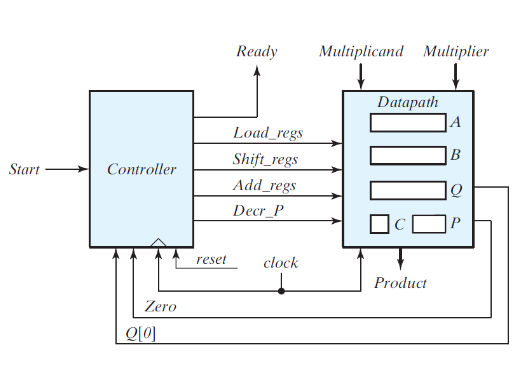

# Proyecto_Dise-o_Logico

This repository comprises exercises, assignments, and the final project for the Logic Design course. It includes examples of fundamental Verilog modules such as registers, ALUs, and counters, along with more complex systems like state machines and controllers. The culminating project involves the creation of a unit capable of performing binary multiplications with 8-bit operands.

